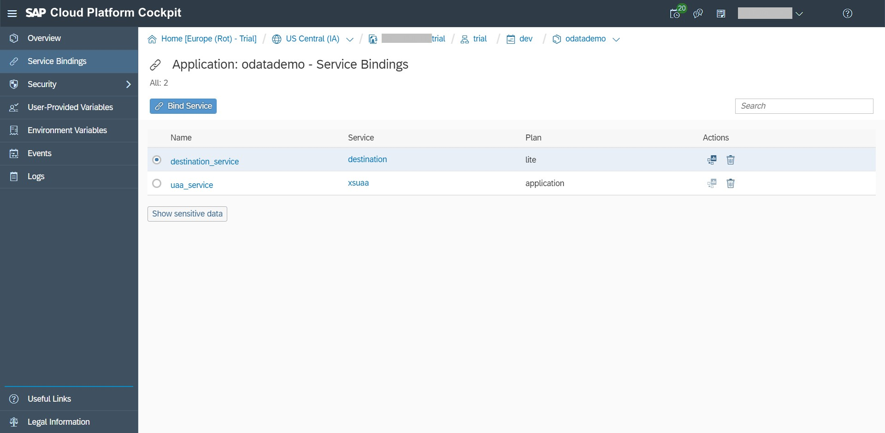

# Consume OData SAP Gateway Service by using Python Flask REST API application in SAP Cloud Platform - Cloud Foundry
A sample of integration between SAP Gateway OData service, Python Flask REST API and SAP Cloud Platform - Cloud Foundry

## Table of contents
- [Getting Started](#getting-started)
- [You will learn](#you-will-learn)
- [Scope & Scenario](#scope---scenario)
- [Prerequisites](#prerequisites)
  * [1. Basic understanding of differences between SCP environments: Neo, Cloud Foundry, ABAP.](#1-basic-understanding-of-differences-between-scp-environments--neo--cloud-foundry--abap)
  * [2. SAP Cloud Platform account](#2-sap-cloud-platform-account)
  * [3. Cloud Foundry (CF) environment account](#3-cloud-foundry--cf--environment-account)
  * [4. Cloud Foundry Command Line Interface (CLI)](#4-cloud-foundry-command-line-interface--cli-)
  * [5. SAP Gateway Demo System - ES5 account](#5-sap-gateway-demo-system---es5-account)
- [Deployment](#deployment)
  * [STEP 1: Create Destination in SAP CF](#step-1--create-destination-in-sap-cf)
  * [STEP 2: Create a Destination Service Instance in SAP CF](#step-2--create-a-destination-service-instance-in-sap-cf)
  * [STEP 3: Create an Extended Application Service User Account & Authentication - XSUAA Service Instance in SAP CF](#step-3--create-an-extended-application-service-user-account---authentication---xsuaa-service-instance-in-sap-cf)
  * [STEP 4: Develop Python Application](#step-4--develop-python-application)
    + [runtime.txt](#runtimetxt)
    + [main.py](#mainpy)
    + [requirement.txt](#requirementtxt)
    + [Procfile](#procfile)
    + [manifest.yml](#manifestyml)
  * [STEP 5: Deploy Python Application to SCP CF](#step-5--deploy-python-application-to-scp-cf)
  * [STEP 6: Test Your Python Flask REST API application](#step-6--test-your-python-flask-rest-api-application)

## Getting Started

When I explore SAP Conversational AI (CAI) - formerly known as Recast.AI - I started with plan in mind of connecting the Chatbot to SAP backend. End users interacts with SAP backend, passing or retrieving information via Chatbot interface.

At the time this document is published, it was difficult to find information out there on how the REST API can consume OData service in SAP Gateway, especially on the SAP Cloud Platform (SCP) Cloud Foundry (CF) setup, destination configuration and authentication handling.

I created this document and repository to put pieces of the puzzle together into one place and for my own documentation and reference.

Hope you find this useful for your project and exploration!

## You will learn

1. Create Destination in SAP CF
2. Create a Destination Service Instance in SAP CF
3. Create an Extended Application Service User Account & Authentication - XSUAA Service Instance in SAP CF
4. Develop and deploy Python application to SCP CF

## Scope & Scenario

A Python Flask base REST API will be deployed in SCP CF.

This repository uses SAP Gateway Demo System ES5 (ES5) as SAP Gateway and backend. It has quite a number of OData services that can be consumed.

HTTP call will trigger Python Flask application to retrieve information from SAP backend via OData service.

In SAP CAI context, you can use this Python Flask application as webhook endpoint:


## Prerequisites

### 1. Basic understanding of differences between SCP environments: Neo, Cloud Foundry, ABAP.

The below SAP Help page link will give you basic idea of different development environments:
https://help.sap.com/viewer/65de2977205c403bbc107264b8eccf4b/Cloud/en-US/ab512c3fbda248ab82c1c545bde19c78.html

This SAP blog post also has a good summary on differences between Neo and Cloud Foundry environment:  
https://blogs.sap.com/2019/02/24/sap-cloud-platform-environment-cloud-foundry-vs-neo/


### 2. SAP Cloud Platform account

How can I get account on SAP Cloud Platform? You do not have to worry. SAP offers UNLIMITED duration of a free trial account on SCP Neo environment :)

You may refer to below article on how to get one:  
https://developers.sap.com/tutorials/hcp-create-trial-account.html


### 3. Cloud Foundry (CF) environment account

In [Prerequisites No. 1](#1.-Basic-understanding-of-differences-between-SCP-environments:-Neo,-Cloud-Foundry,-ABAP.), you learnt that Cloud Foundry environment offers deployment of Python application.

You can get a 90 days Cloud Foundry environment trial account from SAP via SCP cockpit. Your setup and configuration will be removed once expired. However, you still can reapply for a new one.

Follow the below tutorial to get a Cloud Foundry trial account:  
https://developers.sap.com/tutorials/cp-cf-create-account.html


### 4. Cloud Foundry Command Line Interface (CLI)

Although we can deploy the application directly via SCP cockpit, but in this document, I use Cloud Foundry CLI to deploy the application.

Refer to step 4 - 6 in this tutorial, to download and setup CLI to connect to your Cloud Foundry environment:  
https://developers.sap.com/india/tutorials/hcp-cf-getting-started.html


### 5. SAP Gateway Demo System - ES5 account
SAP provides a public SAP Gateway that is based on SAP Netweaver 751 and it comes with some sample of OData services.

More info on SAP Gateway Demo can be found here:  
https://blogs.sap.com/2017/12/05/new-sap-gateway-demo-system-available/

Check this for you to sign-up for an account on the gateway demo system:  
https://developers.sap.com/sea/tutorials/gateway-demo-signup.html

Please note that SAP Gateway and other backend system are usually behind firewall, but that's not the case for ES5.

You will need SAP Cloud Connector to connect your _behind firewall_ on-premise system to SAP Cloud Platform. However, SAP Cloud Connector will not be discussed in this document.

## Deployment

This illustration from SAP Help gives the rough idea on the process flow between components.


Below are steps for the deployment of Python Flask REST API application in SCP CF.

### STEP 1: Create Destination in SAP CF

In the Cloud Foundry environment, you can create destinations at two different levels:
* Subaccount level
* Service instance level

Check this link for details:  
https://help.sap.com/viewer/cca91383641e40ffbe03bdc78f00f681/Cloud/en-US/82ca377549c5421a8199013ea5f0facc.html

In this document, destination will be created in Subaccount level.

Go to your CF environment from SCP cockpit.


Click on *Destinations* in your SAP CF *Subaccount*.


Click "New Destination".

Note that in the screenshot, I already have a Destination called Northwind, but you can ignore this.

Configure the destination to connect to ES5 by using your *ES5 user account* and *password*.  
Destination name that is used in this repository is *SAP_Gateway*.


Save and check connection to ES5.


**Result:**  
You have configured a Destination in SCP CF to connect to SAP ES5 Gateway Demo System. Destination name is *"SAP_Gateway"*.


### STEP 2: Create a Destination Service Instance in SAP CF

Destination service instance will be created within the existing space of your SCP CF.

In your SCP CF space (in the picture, my space name is *"dev"*), click on *Service Marketplace*. Filter/search for Destination service and click on its tile.


Click on *New Instance*.


Create a new instance under *lite* service plan. Instance name is *"destination_service"*.


Note that you can do binding to application directly here (will need to restart the application afterwards). However, in this document, binding will be done via [manifest.yml](manifest.yml) file during the deployment of application. You can see the detail later in [Step 4](#STEP-4:-Develop-and-deploy-Python-application-to-SCP-CF).

**Result:**  
You have configured a destination instance service in SCP CF. Destination instance service name is *"destination_service"*.


### STEP 3: Create an Extended Application Service User Account & Authentication - XSUAA Service Instance in SAP CF

Same as Destination service instance, XSUAA service instance will also be created within the existing space of your SCP CF.

In *Service Marketplace*, filter/search with keyword Authorization and click on its tile.


Click on *New Instance*.


Create a new instance under *application* service plan. Instance name is *"uaa_service"*.


You can do binding to application directly here (will need to restart the application afterwards), but in this document, binding will be done via [manifest.yml](manifest.yml) file during the deployment of application. Detail in [Step 4](#STEP-4:-Develop-and-deploy-Python-application-to-SCP-CF).

**Result:**  
You have configured an XSUAA instance service in SCP CF. UAA instance service name is *"uaa_service"*.


### STEP 4: Develop Python Application

#### runtime.txt
I use Python 2.7.15 as per recommendation of Python version for SAP CAI (Python 2.7+).

#### main.py
The python file.  

I use the below blog post as base of my python application for consuming destination service and authentication process with some modifications here and there:  
https://blogs.sap.com/2018/10/08/using-the-destination-service-in-the-cloud-foundry-environment/

`/odata_es5` is application routing that will consume ES5 OData service.
OData service that I use here is EPM_REF_APPS_SHOP_SRV and it will return Products entity in json format.

Pay attention to `sDestinationName`, `sURI` and `sClient` for the destination name configured in [Step 1](#STEP-1:-Create-Destination-in-SAP-CF), the URI of OData service and client number of SAP Gateway.

```
@app.route('/odata_es5')
def odata_es5():
    sDestinationName = 'SAP_Gateway'
    sURI = '/sap/opu/odata/sap/EPM_REF_APPS_SHOP_SRV/Products'
    #Client number can be defined here to override default client in Destinations
    sClient = ''

    r = scp_connect(sDestinationName, sURI, sClient)
    results = r.json()

    return jsonify(**results)
```

Name of XSUAA service instance and Destination service instance are defined in `scp_connect` function:

```
uaa_service = env.get_service(name='uaa_service')
dest_service = env.get_service(name='destination_service')
```

#### requirement.txt
The required packages/libraries used by [main.py](#main.py).

```
requests
flask
cfenv
```

#### Procfile
Command run of application.

```
web: PORT=8080 python main.py
```

#### manifest.yml
When the application is deployed to SCP CF, it will check application configuration exists in manifest file, for example the application name, memory, number of instance, etc.

In our case, I use manifest.yml to bind the application to the 2 instance services that have been created earlier (destination instance service and XSUAA instance service).

```
---
applications:
- memory: 128MB
  instances: 1
  services:
    - destination_service
    - uaa_service
```

### STEP 5: Deploy Python Application to SCP CF
Go to your terminal inside the folder of your python application, push the application to SCP CF using `cf push` command.

```
$ cf push odatademo
```
For the example of above `cf push` command, the application name in SCP CF will be *odatademo*.

If it is successful, you will see something like this in your terminal.

```
Waiting for app to start...

name:              odatademo
requested state:   started
routes:            odatademo.cfapps.us30.hana.ondemand.com
last uploaded:     Fri 05 Apr 10:04:17 +08 2019
stack:             cflinuxfs3
buildpacks:        python

type:            web
instances:       1/1
memory usage:    128M
start command:   PORT=8080 python main.py
     state     since                  cpu    memory         disk           details
#0   running   2019-04-05T02:04:34Z   0.0%   2.9M of 128M   131.2M of 1G
```

Note on the routes where it is the address of your Python Flask REST API application.

Check the binding in SCP Cockpit, under the application. You should get something like this when the binding is successful:


### STEP 6: Test Your Python Flask REST API application
Use your browser to test your Python Flask REST API application.

The REST API URL that will consume ES5 OData service is
https://odatademo.cfapps.us30.hana.ondemand.com/odata_es5

As a result, you will get a list of product in json format.


Thanks for the time to go through this document and repository and hope you find it useful!
